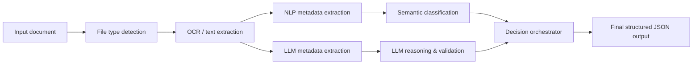

# AI Document Routing & Metadata Extraction Pipeline

A sanitized portfolio case study of a commercial AI-powered document processing pipeline for public-sector administrative documents.

The project focused on automating document intake, OCR, metadata extraction, semantic classification and final decision orchestration using a combination of traditional NLP techniques and local LLM-based validation.

> This repository is a **public portfolio version**.  
> It does **not** contain proprietary source code, client data, internal infrastructure details, credentials, production configuration, private package URLs or real documents.

---

## Project Summary

The system was designed to support automated processing of incoming administrative documents.

The pipeline converted unstructured files into structured metadata that could later be used for document routing, classification and export.

The general processing flow was:



---

## My Role

My work focused on building and improving parts of the AI processing pipeline, including:

- OCR-based text extraction workflow,
- metadata extraction from administrative documents,
- classification logic based on semantic similarity,
- LLM-assisted validation of extracted fields,
- decision orchestration between NLP-based and LLM-based outputs,
- structured JSON output design,
- code organization and workflow orchestration,
- testing and documentation.

---

## Main Features

- Document intake for multiple file formats
- OCR processing for scanned or image-based files
- Metadata extraction from unstructured text
- Identification of key administrative fields
- Semantic classification using embeddings
- LLM-based secondary extraction and validation
- Decision orchestrator comparing multiple extraction results
- Final normalized JSON output
- Modular pipeline structure
- Testable and configurable workflow design

---

## Technologies Used

The original commercial project involved technologies from the following areas:

- Python
- OCR
- NLP
- Embeddings
- Semantic search
- Local LLMs
- JSON-based structured output
- Workflow orchestration
- Docker-based deployment
- Automated testing
- CI/CD concepts

This public repository intentionally describes the architecture and engineering approach without exposing private implementation details.

---

## Repository Structure

```text
ai-document-routing-ocr-case-study/
│
├── README.md
├── NOTICE.md
├── .gitignore
│
├── docs/
│   ├── architecture-overview.md
│   ├── processing-flow.md
│   ├── my-role.md
│   ├── testing-and-quality.md
│   └── security-and-confidentiality.md
│
├── diagrams/
│   ├── architecture.mmd
│   └── processing-flow.mmd
│
└── examples/
    ├── sample-document.txt
    ├── sample-output.json
    └── pipeline-pseudocode.py
```

---

## Example Output

The final pipeline output was designed as a normalized JSON object.

```json
{
  "document_metadata": {
    "case_number": "CASE-2025-001",
    "document_date": "2025-01-15",
    "sender": "Example Sender",
    "recipient": "Example Public Office"
  },
  "classification": {
    "department_code": "DEMO-UNIT",
    "category_code": "DEMO-CATEGORY",
    "confidence": 0.91
  },
  "decision_orchestrator": {
    "selected_source": "hybrid",
    "reasoning_summary": "The final result was selected after comparing rule-based, semantic and LLM-assisted extraction outputs."
  }
}
```

A full sanitized example is available in [`examples/sample-output.json`](examples/sample-output.json).

---

## Architecture Overview

The project used a hybrid architecture.

Traditional NLP and semantic similarity methods were responsible for deterministic and explainable extraction/classification.  
LLM-based processing was used as an independent validation layer for ambiguous fields and complex document structures.  
A decision orchestrator compared both outputs and selected the most reliable final value for each field.

More details are available in [`docs/architecture-overview.md`](docs/architecture-overview.md).

---

## Why This Repository Is Sanitized

The original project was developed in a commercial environment.

For confidentiality and intellectual property reasons, this public version includes only:

- high-level architecture,
- sanitized documentation,
- synthetic examples,
- pseudocode,
- portfolio-oriented explanation.

It does not include:

- production source code,
- client data,
- real administrative documents,
- internal endpoints,
- credentials,
- private infrastructure names,
- private package registry URLs,
- deployment secrets.

See [`docs/security-and-confidentiality.md`](docs/security-and-confidentiality.md).

---

## Skills Demonstrated

This project demonstrates practical experience in:

- AI document processing,
- OCR and text extraction,
- metadata extraction,
- semantic search and embeddings,
- LLM-assisted validation,
- decision orchestration,
- data normalization,
- clean project documentation,
- testing-oriented development,
- safe public portfolio presentation of commercial work.

---

## Status

This repository is a portfolio case study and does not represent a runnable production system.

---

## Author

Created by Marceli Lehmann.

---

## License

This repository is provided for portfolio and educational presentation purposes only.

No proprietary code, confidential data or client-specific implementation details are included.
