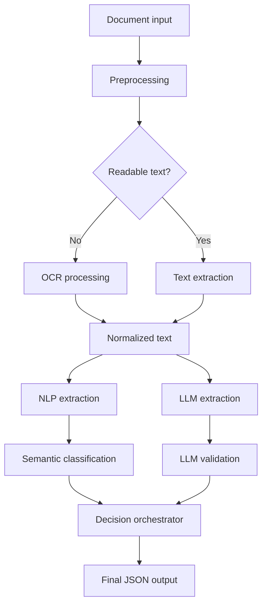

# Architecture Overview

This document describes the high-level architecture of a sanitized AI document processing pipeline.

The original project was created in a commercial environment, so this public version does not include any proprietary implementation details.

---

## Goal

The goal of the system was to transform incoming administrative documents into structured metadata that could be used for classification, routing and export.

The system had to handle documents with different formats, structures and quality levels.

---

## High-Level Architecture

---

## Main Components

### 1. Document Intake

The pipeline accepted different types of input files and prepared them for further processing.

The intake stage was responsible for:

- detecting file type,
- validating input,
- preparing files for text extraction,
- separating readable documents from scanned/image-based documents.

---

### 2. OCR / Text Extraction

Documents that did not contain machine-readable text were processed with OCR.

The purpose of this stage was to extract clean text while preserving enough structure to support later metadata extraction.

---

### 3. NLP Metadata Extraction

The NLP layer extracted key fields from the document text.

Typical extracted fields included:

- case number,
- document date,
- sender,
- recipient,
- identification numbers,
- organizational unit,
- document category.

---

### 4. Semantic Classification

The classification layer compared document content with a predefined knowledge base of categories and definitions.

This made it possible to match documents to the most likely routing category based on meaning, not only exact keyword matching.

---

### 5. LLM-Based Extraction and Validation

The LLM layer worked independently from the traditional extraction flow.

Its role was to:

- extract alternative metadata candidates,
- reason over ambiguous document fragments,
- validate uncertain fields,
- correct incomplete or inconsistent values.

---

### 6. Decision Orchestrator

The decision orchestrator compared results from multiple extraction paths.

It selected the final value for each field based on:

- agreement between extraction methods,
- confidence scores,
- consistency with source text,
- completeness,
- field-specific validation rules.

---

### 7. Structured JSON Output

The final result was exported as a normalized JSON object.

The output structure was designed to be easy to validate, store and consume by other systems.

---

## Key Engineering Idea

The main architectural idea was to avoid relying on only one extraction method.

Instead, the system used a hybrid approach:

- deterministic extraction where possible,
- semantic similarity for classification,
- LLM reasoning for ambiguous cases,
- decision orchestration for final output selection.

This made the pipeline more robust and easier to debug.
