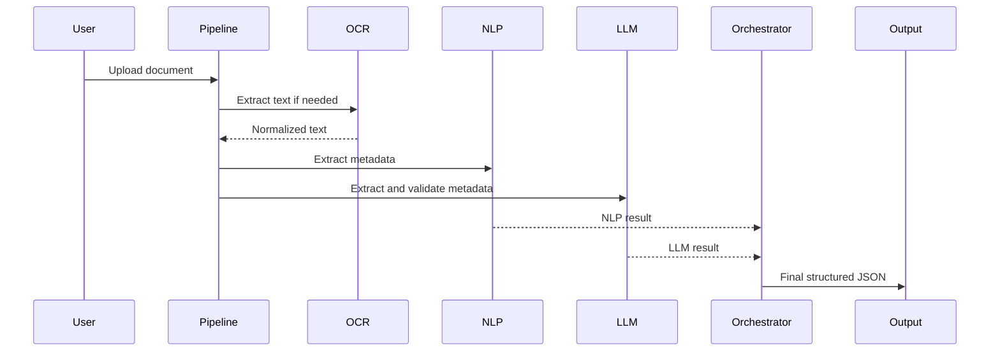

# Processing Flow

This document describes the sanitized processing flow of the AI document routing pipeline.

---

## Step 1: Input Document

A document enters the system as a file.

Supported document types in the original project included common office and document formats such as PDFs and images.

In this public case study, only the general processing logic is described.

---

## Step 2: File Type Detection

The system detects the file type and decides how the document should be processed.

Example decisions:

- PDF with readable text -> direct text extraction,
- scanned PDF -> OCR,
- image file -> OCR,
- unsupported file -> validation error.

---

## Step 3: OCR or Text Extraction

The system extracts text from the document.

The goal is to produce a normalized text representation that can be passed to later stages.

---

## Step 4: NLP-Based Extraction

Traditional extraction logic identifies structured fields from the text.

This may include:

- pattern matching,
- named entity recognition,
- field-specific validation,
- simple confidence scoring.

---

## Step 5: Semantic Classification

The document is compared against a structured classification knowledge base.

The goal is to select the most relevant category or organizational unit based on the semantic meaning of the document.

---

## Step 6: LLM-Based Extraction

In parallel, an LLM analyzes the same document text and returns an alternative structured interpretation.

This is useful when the document is complex, incomplete or formatted in an unusual way.

---

## Step 7: Decision Orchestration

The orchestrator compares the NLP result and the LLM result.

For each field, it decides which value is more reliable.

Example decision logic:

```text
if NLP and LLM agree:
    accept value
else if one value is missing:
    select complete value
else if one value better matches source text:
    select better-supported value
else:
    mark field for review
```

---

## Step 8: Final JSON Output

The final result is exported as a clean JSON object.

The output can be used by another application, stored in a database or passed to a document management system.

---

## Simplified Flow Diagram


